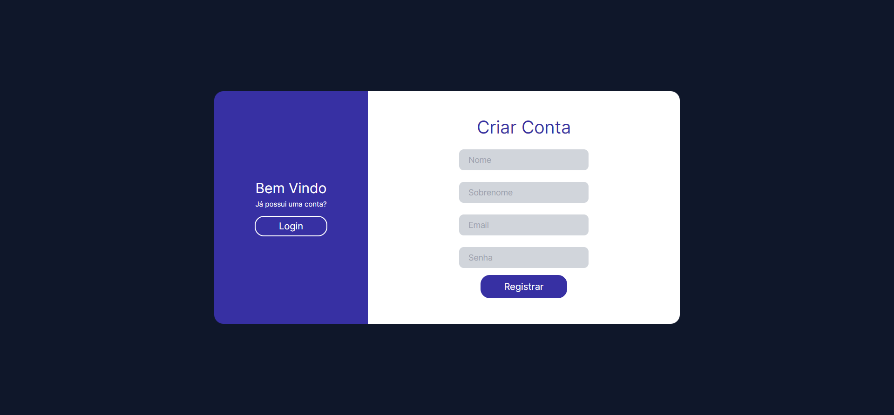

# Login - Register

This application simulates a simple login or registration screen.

## How to Clone and Run

To clone the project repository and run it on your local machine, follow the instructions below:

1. Clone the repository using the command `git clone <repository URL>`.
2. Navigate to the project directory: `cd login-registrar-next`.
3. Install the dependencies using the command `npm install`.
4. Run the application using the command `npm run dev`.
5. Access the application in your browser at `http://localhost`.

## Layout

## Technologies Used

- Next
- Tailwind
- TypeScript
- HTML
- CSS